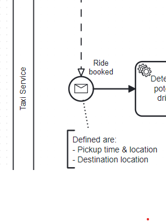

# Camunda 7 to Camunda 8 Migration Case Study

This case study demonstrates the conversion of the [Taxiride.bpmn](https://github.com/Phactum/taxiride-blueprint/blob/main/ride/src/main/resources/processes/camunda7/ride/TaxiRide.bpmn) Camunda 7 Process Model from the [TaxiRide Blueprint](https://github.com/phactum/taxiride-blueprint) project into a Cmaunda 8 Process Model. 

The [TaxiRide Blueprint](https://github.com/phactum/taxiride-blueprint) project demonstrates how [VanillaBP](https://github.com/vanillabp/spi-for-java) can be used to abstract the underlying Processengine.
The [TaxiRide Blueprint](https://github.com/phactum/taxiride-blueprint) can be run using either Camunda7 or Camunda8 while using the same Springboot implementation. Within the Blueprint, two process models are provided, one for using Camunda 7, one for using Camunda 8. 

In this case study, the Camunda 7 Model is converted into a Cmaunda 8 Model and compared with the provided Camunda 8 Model in the Project.

---

## 2. BPMN Process Description

The process consists of two swimlanes: one representing the implemented Taxi Service and the other illustrating the Customer perspective.
The Customer view is not connected to any implementation and serves purely as a descriptive element to help understand the end-to-end process.
Even tho both Swimlanes remain in the converted Process, this case study will only focus in the Taxi Service.  

The original [Camunda 7 Ride process](https://github.com/Phactum/taxiride-blueprint/blob/main/ride/src/main/resources/processes/camunda7/ride/TaxiRide.bpmn) contains the following BPMN elements:

- **Start Events:** 2
- **End Events:** 11 - 8 None End Events, 3 Message End Events
- **User Tasks:** 0
- **Service Tasks:** 6
- **User Tasks:** 1
- **Boundary Events:** 5 - 1 non-Interrupting, 4 interrupting
- **Intermediate Events:** 3
- **Subprocesses:** 2
- **Multi Instance Task Marker:** 3


---

## 3. Mapping and Conversion Details

Using the [Vanilla Converter](https://github.com/dsunaric/vanilla-converter), the following mappings were applied to successfully transform the Camunda 7 BPMN model into a Camunda 8-compatible format:

### Mapping

| Element ID        | Element Name                | Element Type        | Screenshot                                        | Camunda 7 XML | Camunda 8 XML (expected) | Camunda 8 Conversion | Evaluation |
|-------------------|-----------------------------|---------------------|---------------------------------------------------|----------------|--------------------------|----------------------|------------|
| Event_0jpj0lo     | Ride booked                 | Message Start Event |            | ```xml ```     | ```xml ```               |                      |            |
| Activity_16rijgh  | Determine potential drivers | Service Task        |      | ```xml ```     | ```xml ```               |                      |            |
|                   |                             |                | ```xml ```                                        | ```xml ```     |                          |                      |            |


### ⚠️ Not Yet Mapped / Limitations


---

