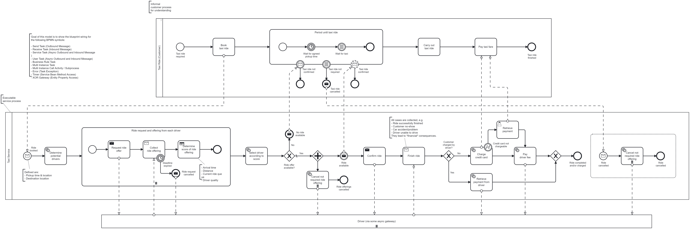

# Camunda 7 to Camunda 8 Migration Case Study

This case study demonstrates the conversion of the [Taxiride.bpmn](https://github.com/Phactum/taxiride-blueprint/blob/main/ride/src/main/resources/processes/camunda7/ride/TaxiRide.bpmn) Camunda 7 Process Model from the [TaxiRide Blueprint](https://github.com/phactum/taxiride-blueprint) project into a Cmaunda 8 Process Model. 

The [TaxiRide Blueprint](https://github.com/phactum/taxiride-blueprint) project demonstrates how [VanillaBP](https://github.com/vanillabp/spi-for-java) can be used to abstract the underlying Processengine.
The [TaxiRide Blueprint](https://github.com/phactum/taxiride-blueprint) can be run using either Camunda7 or Camunda8 while using the same Springboot implementation. Within the Blueprint, two process models are provided, one for using Camunda 7, one for using Camunda 8. 

In this case study, the Camunda 7 Model is converted into a Camunda 8 Model and compared with the provided Camunda 8 Model in the Project.

---

## 2. BPMN Process Description

The process consists of two swimlanes: one representing the implemented Taxi Service and the other illustrating the Customer perspective.
The Customer view is not connected to any implementation and serves purely as a descriptive element to help understand the end-to-end process.
Even tho both Swimlanes remain in the converted Process, this case study will only focus in the Taxi Service.  

The original [Camunda 7 Ride process](https://github.com/Phactum/taxiride-blueprint/blob/main/ride/src/main/resources/processes/camunda7/ride/TaxiRide.bpmn) contains the following BPMN elements:

- **Start Events:** 2
- **End Events:** 11 - 8 None End Events, 3 Message End Events
- **Service Tasks:** 6
- **User Tasks:** 1
- **Boundary Events:** 5 - 1 non-Interrupting, 4 interrupting
- **Intermediate Events:** 3
- **Subprocesses:** 2
- **Multi Instance Task Marker:** 3

---

## 3. Mapping and Conversion Details

Using the [Vanilla Converter](https://github.com/dsunaric/vanilla-converter), the following mappings were applied to successfully transform the Camunda 7 BPMN model into a Camunda 8-compatible format:

### Mapping Details

| Element-ID                   | Camunda 7 XML Representation                                                                                                                                                                                                                                                                                                                                                                                                                                                                                                                                                                                                    | Provided Camunda 8 representation (expected)                                                                                                                                                                                                                                                                                                                                                                                                                                                                                                                                                                                                                                                                                                                                                                                                                                                                                                                                     | Camunda 8 transformation                                                                                                                                                                                                                                                                                                                                                                                                                                                                                                                                                                                                                                                                                                                                                                                                                                                                                                                | Log output                                                                                                                                                                                                                                                                                                                                                                                                                                                                                                                                                                                                                                                                                                                                                                                                                                                                                                               | Actual Todo's                                                                                                                                              |
|------------------------------|---------------------------------------------------------------------------------------------------------------------------------------------------------------------------------------------------------------------------------------------------------------------------------------------------------------------------------------------------------------------------------------------------------------------------------------------------------------------------------------------------------------------------------------------------------------------------------------------------------------------------------|----------------------------------------------------------------------------------------------------------------------------------------------------------------------------------------------------------------------------------------------------------------------------------------------------------------------------------------------------------------------------------------------------------------------------------------------------------------------------------------------------------------------------------------------------------------------------------------------------------------------------------------------------------------------------------------------------------------------------------------------------------------------------------------------------------------------------------------------------------------------------------------------------------------------------------------------------------------------------------|-----------------------------------------------------------------------------------------------------------------------------------------------------------------------------------------------------------------------------------------------------------------------------------------------------------------------------------------------------------------------------------------------------------------------------------------------------------------------------------------------------------------------------------------------------------------------------------------------------------------------------------------------------------------------------------------------------------------------------------------------------------------------------------------------------------------------------------------------------------------------------------------------------------------------------------------|--------------------------------------------------------------------------------------------------------------------------------------------------------------------------------------------------------------------------------------------------------------------------------------------------------------------------------------------------------------------------------------------------------------------------------------------------------------------------------------------------------------------------------------------------------------------------------------------------------------------------------------------------------------------------------------------------------------------------------------------------------------------------------------------------------------------------------------------------------------------------------------------------------------------------|------------------------------------------------------------------------------------------------------------------------------------------------------------|
| Event_0jpj0lo                | `<bpmn:startEvent id="Event_0jpj0lo" name="Ride&#10;booked" camunda:asyncBefore="true">  [...] <bpmn:messageEventDefinition id="MessageEventDefinition_1ai0b3d" messageRef="Message_165aq6x" />     </bpmn:startEvent>`                                                                                                                                                                                                                                                                                                                                                                                                      | `<bpmn:startEvent id="Event_0jpj0lo" name="Ride&#10;booked" camunda:asyncBefore="true">       [...]       <bpmn:messageEventDefinition id="MessageEventDefinition_1ai0b3d" messageRef="Message_165aq6x" />     </bpmn:startEvent>`                                                                                                                                                                                                                                                                                                                                                                                                                                                                                                                                                                                                                                                                                                                                      | `<bpmn:startEvent id="Event_0jpj0lo" name="Ride&#10;booked" camunda:asyncBefore="true">       [...]       <bpmn:messageEventDefinition id="MessageEventDefinition_1ai0b3d" messageRef="Message_165aq6x" />     </bpmn:startEvent>`                                                                                                                                                                                                                                                                                                                                                                                                                                                                                                                                                                                                                                                                                             | `MAPPING: bpmn:event with id=Event_0jpj0lo MAPPING: bpmn:eventDefinition with id=MessageEventDefinition_1ai0b3d NO MAPPING NEEDED: for element with id=MessageEventDefinition_1ai0b3d FINISHED MAPPING: bpmn:eventDefinition with id=MessageEventDefinition_1ai0b3d FINISHED MAPPING: bpmn:event with id=Event_0jpj0lo`                                                                                                                                                                                                                                                                                                                                                                                                                                                                                                                                                                                      | \-                                                                                                                                                         |
| Activity_16rijgh             | `<bpmn:serviceTask id="Activity_16rijgh" name="Determine&#10;potential&#10;drivers" camunda:delegateExpression="${determinePotentialDrivers}">  [...] </bpmn:serviceTask>`                                                                                                                                                                                                                                                                                                                                                                                                                                                      | `<bpmn:serviceTask id="Activity_16rijgh" name="Determine&#10;potential&#10;drivers">       <bpmn:extensionElements>         <zeebe:taskDefinition type="determinePotentialDrivers" />       </bpmn:extensionElements>       [...]     </bpmn:serviceTask>`                                                                                                                                                                                                                                                                                                                                                                                                                                                                                                                                                                                                                                                                                                        | `<bpmn:serviceTask id="Activity_16rijgh" name="Determine&#10;potential&#10;drivers">       <bpmn:extensionElements>         <zeebe:taskDefinition type="determinePotentialDrivers" />       </bpmn:extensionElements>       [...]     </bpmn:serviceTask>`                                                                                                                                                                                                                                                                                                                                                                                                                                                                                                                                                                                                                                                               | `MAPPING: Task with id=Activity_16rijgh MAPPING: bpmn:delegateExpression ${determinePotentialDrivers} into zeebe:taskDefinition MAPPING: camunda:expression ${determinePotentialDrivers} into FEEL Expression Language TODO (OPTIONAL): set retries=?? in zeebe:taskDefinition Element TODO (OPTIONAL): adapt zeebe:taskDefinition type for Task with id=Activity_16rijgh to select correct JobWorker FINISHED MAPPING: Task with id=Activity_16rijgh`                                                                                                                                                                                                                                                                                                                                                                                                                                                    | \-                                                                                                                                                         |
| RequestRideOffer             | `<bpmn:subProcess id="RequestRideOffer" name="Ride request and offering from each driver" camunda:asyncBefore="true">       <bpmn:extensionElements><camunda:inputOutput>           <camunda:inputParameter name="RequestRideOffer_index">${loopCounter}</camunda:inputParameter></camunda:inputOutput>       </bpmn:extensionElements>  <bpmn:multiInstanceLoopCharacteristics camunda:asyncBefore="true">         <bpmn:loopCardinality xsi:type="bpmn:tFormalExpression">${potentialDrivers.size()}</bpmn:loopCardinality>       </bpmn:multiInstanceLoopCharacteristics> [....] </bpmn:subProcess>` | `<bpmn:subProcess id="RequestRideOffer" name="Ride request and offering from each driver" camunda:asyncBefore="true">       <bpmn:extensionElements>         <zeebe:ioMapping>           <zeebe:input source="= loopCounter" target="RequestRideOffer_index" />           <zeebe:input source="= count(potentialDrivers)" target="RequestRideOffer_total" />         </zeebe:ioMapping>       </bpmn:extensionElements>       <bpmn:multiInstanceLoopCharacteristics camunda:asyncBefore="true">         <bpmn:extensionElements>           <zeebe:loopCharacteristics inputCollection="= potentialDrivers" inputElement="RequestRideOffer" />         </bpmn:extensionElements>         <bpmn:loopCardinality xsi:type="bpmn:tFormalExpression">${potentialDrivers.size()}</bpmn:loopCardinality>       </bpmn:multiInstanceLoopCharacteristics> [...] </bpmn:subProcess>`                                                            | `<bpmn:subProcess name="Ride request and offering from each driver" id="RequestRideOffer" camunda:asyncBefore="true">             <bpmn:extensionElements>                 <camunda:inputOutput>                     <camunda:inputParameter name="RequestRideOffer_index">${loopCounter}</camunda:inputParameter>         </camunda:inputOutput>             </bpmn:extensionElements>                         <bpmn:multiInstanceLoopCharacteristics camunda:asyncBefore="true">                 <bpmn:extensionElements>                     <zeebe:loopCharacteristics inputCollection="= for i in 1..potentialDrivers.size() return i"/>                 </bpmn:extensionElements>                 <bpmn:loopCardinality xsi:type="bpmn:tFormalExpression">${potentialDrivers.size()}</bpmn:loopCardinality>             </bpmn:multiInstanceLoopCharacteristics> [...] </bpmn:subProcess>` | `MAPPING: <bpmn:subProcess> with id RequestRideOffer TODO: Manually Map Extension Elements of Subprocess with id=RequestRideOffer [...] MAPPING: LoopCharacteristics for element with id=RequestRideOffer MAPPING: camunda:expression ${potentialDrivers.size()} into FEEL Expression Language FINISHED MAPPING: <bpmn:subProcess> with id RequestRideOffer`                                                                                                                                                                                                                                                                                                                                                                                                                                                                                                                                              | the input and output variables must be mapped manually and used as input element for the Multi-instance for this subprocess to work correctly              |
| Event_085bfug                | `<bpmn:startEvent id="Event_085bfug">[…] </bpmn:startEvent>`                                                                                                                                                                                                                                                                                                                                                                                                                                                                                                                                                                    | `<bpmn:startEvent id="Event_085bfug">[...]      </bpmn:startEvent>`                                                                                                                                                                                                                                                                                                                                                                                                                                                                                                                                                                                                                                                                                                                                                                                                                                                                                                              | `<bpmn:startEvent id="Event_085bfug">[...] </bpmn:startEvent>`                                                                                                                                                                                                                                                                                                                                                                                                                                                                                                                                                                                                                                                                                                                                                                                                                                                                          | `MAPPING: bpmn:event with id=Event_085bfug NO MAPPING NEEDED: for element with id=Event_085bfug FINISHED MAPPING: bpmn:event with id=Event_085bfug`                                                                                                                                                                                                                                                                                                                                                                                                                                                                                                                                                                                                                                                                                                                                                                | \-                                                                                                                                                         |
| Activity_1vse2bh             | `<bpmn:sendTask id="Activity_1vse2bh" name="Request ride offer" camunda:asyncBefore="true" camunda:delegateExpression="${requestRideOfferFromDriver}">[...]</bpmn:sendTask>`                                                                                                                                                                                                                                                                                                                                                                                                                                                    | `<bpmn:sendTask id="Activity_1vse2bh" name="Request ride offer" camunda:asyncBefore="true">         <bpmn:extensionElements>           <zeebe:taskDefinition type="requestRideOfferFromDriver" />         </bpmn:extensionElements>      [...]       </bpmn:sendTask>`                                                                                                                                                                                                                                                                                                                                                                                                                                                                                                                                                                                                                                                                                            | `bpmn:sendTask name="Request ride offer" id="Activity_1vse2bh" camunda:asyncBefore="true">                 <bpmn:extensionElements>                     <zeebe:taskDefinition type="requestRideOfferFromDriver"/>                 </bpmn:extensionElements>                 [...]             </bpmn:sendTask>`                                                                                                                                                                                                                                                                                                                                                                                                                                                                                                                                                                                                          | `MAPPING: Task with id=Activity_1vse2bh MAPPING: bpmn:delegateExpression ${requestRideOfferFromDriver} into zeebe:taskDefinition MAPPING: camunda:expression ${requestRideOfferFromDriver} into FEEL Expression Language TODO (OPTIONAL): set retries=?? in zeebe:taskDefinition Element TODO (OPTIONAL): adapt zeebe:taskDefinition type for Task with id=Activity_1vse2bh to select correct JobWorker FINISHED MAPPING: Task with id=Activity_1vse2bh`                                                                                                                                                                                                                                                                                                                                                                                                                                                  | \-                                                                                                                                                         |
| Activity_19miyyw             | `<bpmn:receiveTask id="Activity_19miyyw" name="Collect&#10;ride offering" messageRef="Message_0kd4337">         <bpmn:extensionElements>           <camunda:inputOutput>             <camunda:inputParameter name="TaxiRide-RideOfferReceived">${rideId.concat("-").concat(potentialDrivers[RequestRideOffer_index].id)}</camunda:inputParameter>           </camunda:inputOutput>         </bpmn:extensionElements>         [...]       </bpmn:receiveTask>`                                                                                                                                              | `<bpmn:receiveTask id="Activity_19miyyw" name="Collect&#10;ride offering" messageRef="Message_0kd4337">[...] </bpmn:receiveTask>`                                                                                                                                                                                                                                                                                                                                                                                                                                                                                                                                                                                                                                                                                                                                                                                                                                                | `<bpmn:receiveTask xmlns="" messageRef="Message_0kd4337" name="Collect&#10;ride offering" id="Activity_19miyyw">                 <bpmn:extensionElements>                     <camunda:inputOutput>                         <camunda:inputParameter name="TaxiRide-RideOfferReceived">${rideId.concat("-").concat(potentialDrivers[RequestRideOffer_index].id)}</camunda:inputParameter>           </camunda:inputOutput>                 </bpmn:extensionElements>             </bpmn:receiveTask>`                                                                                                                                                                                                                                                                                                                                                                                                                  | `MAPPING: ReceiveTask with id=Activity_19miyyw NO MAPPING NEEDED: for element with id=Activity_19miyyw FINISHED MAPPING: ReceiveTask with id=Activity_19miyyw`                                                                                                                                                                                                                                                                                                                                                                                                                                                                                                                                                                                                                                                                                                                                                     | \-                                                                                                                                                         |
| Event_01ckd5n                | `<bpmn:boundaryEvent id="Event_01ckd5n" name="Deadline&#10;expired" attachedToRef="Activity_19miyyw">[...]         <bpmn:timerEventDefinition id="TimerEventDefinition_0cuzrxd">           <bpmn:timeDate xsi:type="bpmn:tFormalExpression">${offeringDeadline}</bpmn:timeDate>         </bpmn:timerEventDefinition>       </bpmn:boundaryEvent>`                                                                                                                                                                                                                                                                   | `<bpmn:boundaryEvent id="Event_01ckd5n" name="Deadline&#10;expired" attachedToRef="Activity_19miyyw">         [...]         <bpmn:timerEventDefinition id="TimerEventDefinition_0cuzrxd">           <bpmn:timeDuration xsi:type="bpmn:tFormalExpression">= date and time(offeringDeadline) - now()</bpmn:timeDuration>         </bpmn:timerEventDefinition>       </bpmn:boundaryEvent>`                                                                                                                                                                                                                                                                                                                                                                                                                                                                                                                                                                          | `<bpmn:boundaryEvent xmlns="" attachedToRef="Activity_19miyyw" name="Deadline&#10;expired" id="Event_01ckd5n">                 [...]                 <bpmn:timerEventDefinition id="TimerEventDefinition_0cuzrxd">                     <bpmn:timeDate xsi:type="bpmn:tFormalExpression">=offeringDeadline</bpmn:timeDate>                 </bpmn:timerEventDefinition>             </bpmn:boundaryEvent>`                                                                                                                                                                                                                                                                                                                                                                                                                                                                                                                | `MAPPING: bpmn:event with id=Event_01ckd5n MAPPING: bpmn:eventDefinition with id=TimerEventDefinition_0cuzrxd camunda:expression ${offeringDeadline} into FEEL Expression Language TODO (OPTIONAL): for TimerEventDefinition with id TimerEventDefinition_0cuzrxd: set output of expression '${offeringDeadline}' as a variable in ISO8601 format and set variable as this timer events value FINISHED MAPPING: bpmn:event with id=Event_01ckd5n`                                                                                                                                                                                                                                                                                                                                                                                                                                                            | \-                                                                                                                                                         |
| Event_0qn3ukk                | `<bpmn:endEvent id="Event_0qn3ukk" name="Ride request cancelled" camunda:asyncBefore="true">         [...]         <bpmn:messageEventDefinition id="MessageEventDefinition_034zqie" camunda:delegateExpression="${cancelRideOfferOfDriver}" />       </bpmn:endEvent>`                                                                                                                                                                                                                                                                                                                                                 | `<bpmn:endEvent id="Event_0qn3ukk" name="Ride request cancelled" camunda:asyncBefore="true">         <bpmn:extensionElements>           <zeebe:taskDefinition type="cancelRideOfferOfDriver" />         </bpmn:extensionElements>         [...]         <bpmn:messageEventDefinition id="MessageEventDefinition_034zqie" camunda:delegateExpression="${cancelRideOfferOfDriver}" />       </bpmn:endEvent>`                                                                                                                                                                                                                                                                                                                                                                                                                                                                                                                                                    | `<bpmn:endEvent name="Ride request cancelled" id="Event_0qn3ukk" camunda:asyncBefore="true">                 <bpmn:extensionElements>                     <zeebe:taskDefinition type="cancelRideOfferOfDriver"/>                 </bpmn:extensionElements>                [...]                 <bpmn:messageEventDefinition id="MessageEventDefinition_034zqie" camunda:delegateExpression="${cancelRideOfferOfDriver}"/>             </bpmn:endEvent>`                                                                                                                                                                                                                                                                                                                                                                                                                                                              | `MAPPING: bpmn:event with id=Event_0qn3ukk MAPPING: bpmn:throwEvent with id=Event_0qn3ukk MAPPING: bpmn:eventDefinition with id=MessageEventDefinition_034zqie NO MAPPING NEEDED: for element with id=MessageEventDefinition_034zqie FINISHED MAPPING: bpmn:eventDefinition with id=MessageEventDefinition_034zqie MAPPING: camunda:delegateExpression ${cancelRideOfferOfDriver} into zeebe:taskDefinition MAPPING: bpmn:delegateExpression ${cancelRideOfferOfDriver} into zeebe:taskDefinition MAPPING: camunda:expression ${cancelRideOfferOfDriver} into FEEL Expression Language TODO (OPTIONAL): set retries=?? in zeebe:taskDefinition Element TODO (OPTIONAL): adapt zeebe:taskDefinition type for Message Event with id=Event_0qn3ukk to select correct JobWorker FINISHED MAPPING: bpmn:throwEvent with id=Event_0qn3ukk FINISHED MAPPING: bpmn:event with id=Event_0qn3ukk` | \-                                                                                                                                                         |
| Activity_0avhaum             | `<bpmn:businessRuleTask id="Activity_0avhaum" name="Determine score of ride offering" camunda:asyncBefore="true" camunda:delegateExpression="${scoreOfferOfDriver}">[...]</bpmn:businessRuleTask>`                                                                                                                                                                                                                                                                                                                                                                                                                              | `<bpmn:businessRuleTask id="Activity_0avhaum" name="Determine score of ride offering" camunda:asyncBefore="true">         <bpmn:extensionElements>           <zeebe:taskDefinition type="scoreOfferOfDriver" />         </bpmn:extensionElements>         [...]       </bpmn:businessRuleTask>`                                                                                                                                                                                                                                                                                                                                                                                                                                                                                                                                                                                                                                                                   | `<bpmn:businessRuleTask name="Determine score of ride offering" id="Activity_0avhaum" camunda:asyncBefore="true">                 <bpmn:extensionElements>                     <zeebe:taskDefinition type="scoreOfferOfDriver"/>                 </bpmn:extensionElements>                 [...]             </bpmn:businessRuleTask>`                                                                                                                                                                                                                                                                                                                                                                                                                                                                                                                                                                                   | `MAPPING: Task with id=Activity_0avhaum MAPPING: Task with id=Activity_0avhaum MAPPING: bpmn:delegateExpression ${scoreOfferOfDriver} into zeebe:taskDefinition MAPPING: camunda:expression ${scoreOfferOfDriver} into FEEL Expression Language TODO (OPTIONAL): set retries=?? in zeebe:taskDefinition Element TODO (OPTIONAL): adapt zeebe:taskDefinition type for Task with id=Activity_0avhaum to select correct JobWorker FINISHED MAPPING: Task with id=Activity_0avhaum`                                                                                                                                                                                                                                                                                                                                                                                                                        | \-                                                                                                                                                         |
| Event_10kc3kc                | `<bpmn:endEvent id="Event_10kc3kc">[...]</bpmn:endEvent>`                                                                                                                                                                                                                                                                                                                                                                                                                                                                                                                                                                       | `<bpmn:endEvent id="Event_10kc3kc">[...] </bpmn:endEvent>`                                                                                                                                                                                                                                                                                                                                                                                                                                                                                                                                                                                                                                                                                                                                                                                                                                                                                                                       | `<bpmn:endEvent id="Event_10kc3kc">[...] </bpmn:endEvent>`                                                                                                                                                                                                                                                                                                                                                                                                                                                                                                                                                                                                                                                                                                                                                                                                                                                                              | `MAPPING: bpmn:event with id=Event_10kc3kc MAPPING: bpmn:throwEvent with id=Event_10kc3kc NO MAPPING NEEDED: for element with id=Event_10kc3kc FINISHED MAPPING: bpmn:event with id=Event_10kc3kc `                                                                                                                                                                                                                                                                                                                                                                                                                                                                                                                                                                                                                                                                                                             | \-                                                                                                                                                         |
| Activity_1f23xe8             | `<bpmn:serviceTask id="Activity_1f23xe8" name="select driver according to score" camunda:asyncBefore="true" camunda:delegateExpression="${selectDriverAccordingToScore}">[...]</bpmn:serviceTask>`                                                                                                                                                                                                                                                                                                                                                                                                                              | `<bpmn:serviceTask id="Activity_1f23xe8" name="select driver according to score" camunda:asyncBefore="true">       <bpmn:extensionElements>         <zeebe:taskDefinition type="selectDriverAccordingToScore" />       </bpmn:extensionElements>       [...]     </bpmn:serviceTask>`                                                                                                                                                                                                                                                                                                                                                                                                                                                                                                                                                                                                                                                                             | `<bpmn:serviceTask name="select driver according to score" id="Activity_1f23xe8" camunda:asyncBefore="true">             <bpmn:extensionElements>                 <zeebe:taskDefinition type="selectDriverAccordingToScore"/>             </bpmn:extensionElements>             [...]         </bpmn:serviceTask>`                                                                                                                                                                                                                                                                                                                                                                                                                                                                                                                                                                                                       | `MAPPING: Task with id=Activity_1f23xe8 MAPPING: bpmn:delegateExpression ${selectDriverAccordingToScore} into zeebe:taskDefinition MAPPING: camunda:expression ${selectDriverAccordingToScore} into FEEL Expression Language TODO (OPTIONAL): set retries=?? in zeebe:taskDefinition Element TODO (OPTIONAL): adapt zeebe:taskDefinition type for Task with id=Activity_1f23xe8 to select correct JobWorker FINISHED MAPPING: Task with id=Activity_1f23xe8`                                                                                                                                                                                                                                                                                                                                                                                                                                              | \-                                                                                                                                                         |
| Gateway_0s3sbcj              | `<bpmn:exclusiveGateway id="Gateway_0s3sbcj" name="Ride offer available?" default="Flow_06mhahk">       [...]     </bpmn:exclusiveGateway>`                                                                                                                                                                                                                                                                                                                                                                                                                                                                               | `<bpmn:exclusiveGateway id="Gateway_0s3sbcj" name="Ride offer available?" default="Flow_06mhahk">[..]</bpmn:exclusiveGateway>`                                                                                                                                                                                                                                                                                                                                                                                                                                                                                                                                                                                                                                                                                                                                                                                                                                                   | `<bpmn:exclusiveGateway default="Flow_06mhahk" name="Ride offer available?" id="Gateway_0s3sbcj">[...]</bpmn:exclusiveGateway>`                                                                                                                                                                                                                                                                                                                                                                                                                                                                                                                                                                                                                                                                                                                                                                                                         | `MAPPING: bpmn:gateway with id=Gateway_0s3sbcj NO MAPPING NEEDED: for element with id=Gateway_0s3sbcj FINISHED MAPPING: bpmn:gateway with id=Gateway_0s3sbcj`                                                                                                                                                                                                                                                                                                                                                                                                                                                                                                                                                                                                                                                                                                                                                      | \-                                                                                                                                                         |
| Flow_1ycx8oz                 | `<bpmn:sequenceFlow id="Flow_1ycx8oz" name="No" sourceRef="Gateway_0s3sbcj" targetRef="Event_0zszlkp">       <bpmn:conditionExpression xsi:type="bpmn:tFormalExpression">${noRideAvailable}</bpmn:conditionExpression>     </bpmn:sequenceFlow>`                                                                                                                                                                                                                                                                                                                                                                          | `<bpmn:sequenceFlow id="Flow_1ycx8oz" name="No" sourceRef="Gateway_0s3sbcj" targetRef="Event_0zszlkp">       <bpmn:conditionExpression xsi:type="bpmn:tFormalExpression">= noRideAvailable</bpmn:conditionExpression>     </bpmn:sequenceFlow>`                                                                                                                                                                                                                                                                                                                                                                                                                                                                                                                                                                                                                                                                                                                            | `<bpmn:sequenceFlow sourceRef="Gateway_0s3sbcj" targetRef="Event_0zszlkp" name="No" id="Flow_1ycx8oz">             <bpmn:conditionExpression xsi:type="bpmn:tFormalExpression">noRideAvailable</bpmn:conditionExpression>         </bpmn:sequenceFlow>`                                                                                                                                                                                                                                                                                                                                                                                                                                                                                                                                                                                                                                                                           | `MAPPING: bpmn:sequenceFlow with id=Flow_1ycx8oz MAPPING: camunda:expression ${noRideAvailable} into FEEL Expression Language FINISHED MAPPING: bpmn:sequenceFlow with id=Flow_1ycx8oz`                                                                                                                                                                                                                                                                                                                                                                                                                                                                                                                                                                                                                                                                                                                            | \-                                                                                                                                                         |
| Flow_06mhahk                 | `<bpmn:sequenceFlow id="Flow_06mhahk" name="Yes" sourceRef="Gateway_0s3sbcj" targetRef="Gateway_10z6zz7" />`                                                                                                                                                                                                                                                                                                                                                                                                                                                                                                                    | `<bpmn:sequenceFlow id="Flow_06mhahk" name="Yes" sourceRef="Gateway_0s3sbcj" targetRef="Gateway_10z6zz7" />`                                                                                                                                                                                                                                                                                                                                                                                                                                                                                                                                                                                                                                                                                                                                                                                                                                                                     | `<bpmn:sequenceFlow sourceRef="Gateway_0s3sbcj" targetRef="Gateway_10z6zz7" name="Yes" id="Flow_06mhahk"/>`                                                                                                                                                                                                                                                                                                                                                                                                                                                                                                                                                                                                                                                                                                                                                                                                                             | `MAPPING: bpmn:sequenceFlow with id=Flow_06mhahk FINISHED MAPPING: bpmn:sequenceFlow with id=Flow_06mhahk`                                                                                                                                                                                                                                                                                                                                                                                                                                                                                                                                                                                                                                                                                                                                                                                                            | \-                                                                                                                                                         |
| Event_0zszlkp                | `<bpmn:endEvent id="Event_0zszlkp" name="No ride&#10;available">       [...]       <bpmn:messageEventDefinition id="MessageEventDefinition_0rftyhb" messageRef="Message_0h5yzo1" />     </bpmn:endEvent>`                                                                                                                                                                                                                                                                                                                                                                                                              | `<bpmn:intermediateThrowEvent id="Event_0zszlkp" name="No ride&#10;available">[...] </bpmn:intermediateThrowEvent>`                                                                                                                                                                                                                                                                                                                                                                                                                                                                                                                                                                                                                                                                                                                                                                                                                                                              | `<bpmn:endEvent name="No ride&#10;available" id="Event_0zszlkp">             [...]             <bpmn:messageEventDefinition xmlns="" messageRef="Message_0h5yzo1" id="MessageEventDefinition_0rftyhb"/>         </bpmn:endEvent>`                                                                                                                                                                                                                                                                                                                                                                                                                                                                                                                                                                                                                                                                                              | `MAPPING: bpmn:event with id=Event_0zszlkp MAPPING: bpmn:throwEvent with id=Event_0zszlkp MAPPING: bpmn:eventDefinition with id=MessageEventDefinition_0rftyhb NO MAPPING NEEDED: for element with id=MessageEventDefinition_0rftyhb FINISHED MAPPING: bpmn:eventDefinition with id=MessageEventDefinition_0rftyhb TODO: manually configure Jobworker for Message Throw Event with id MessageEventDefinition_0rftyhb MAPPING: bpmn:delegateExpression configureJobType into zeebe:taskDefinition MAPPING: camunda:expression configureJobType into FEEL Expression Language TODO (OPTIONAL): set retries=?? in zeebe:taskDefinition Element TODO (OPTIONAL): adapt zeebe:taskDefinition type for Message Event with id=Event_0zszlkp to select correct JobWorker FINISHED MAPPING: bpmn:throwEvent with id=Event_0zszlkp FINISHED MAPPING: bpmn:event with id=Event_0zszlkp`            | Message Send Events need a Jobworker in Camunda 8, either a Jobworker has to be defined or this Message End Event has to be mapped into a None End Event   |
| Gateway_10z6zz7              | `<bpmn:parallelGateway id="Gateway_10z6zz7">[...]</bpmn:parallelGateway>`                                                                                                                                                                                                                                                                                                                                                                                                                                                                                                                                                       | `<bpmn:parallelGateway id="Gateway_10z6zz7">[...] </bpmn:parallelGateway>`                                                                                                                                                                                                                                                                                                                                                                                                                                                                                                                                                                                                                                                                                                                                                                                                                                                                                                       | `<bpmn:parallelGateway id="Gateway_10z6zz7">[...]  </bpmn:parallelGateway>`                                                                                                                                                                                                                                                                                                                                                                                                                                                                                                                                                                                                                                                                                                                                                                                                                                                             | `MAPPING: bpmn:gateway with id=Gateway_10z6zz7 NO MAPPING NEEDED: for element with id=Gateway_10z6zz7 FINISHED MAPPING: bpmn:gateway with id=Gateway_10z6zz7`                                                                                                                                                                                                                                                                                                                                                                                                                                                                                                                                                                                                                                                                                                                                                      | \-                                                                                                                                                         |
| CancelNotRequiredRide        | `<bpmn:serviceTask id="CancelNotRequiredRide" name="Cancel not required ride offering" camunda:asyncBefore="true" camunda:delegateExpression="${cancelRideOfferOfDriver}">        <bpmn:multiInstanceLoopCharacteristics camunda:asyncBefore="true" camunda:collection="${unselectedOffers}" camunda:elementVariable="${unselectedOffer}" />     </bpmn:serviceTask>`                                                                                                                                                                                                                                                     | `<bpmn:serviceTask id="CancelNotRequiredRide" name="Cancel not required ride offering" camunda:asyncBefore="true">       <bpmn:extensionElements>         <zeebe:taskDefinition type="cancelRideOfferOfDriver" />         <zeebe:ioMapping>           <zeebe:input source="= loopCounter" target="CancelNotRequiredRide_index" />           <zeebe:input source="= count(unselectedOffers)" target="CancelNotRequiredRide_total" />         </zeebe:ioMapping>       </bpmn:extensionElements>       [...]       <bpmn:multiInstanceLoopCharacteristics camunda:asyncBefore="true" camunda:collection="${unselectedOffers}" camunda:elementVariable="${unselectedOffer}">         <bpmn:extensionElements>           <zeebe:loopCharacteristics inputCollection="= unselectedOffers" inputElement="CancelNotRequiredRide" />         </bpmn:extensionElements>       </bpmn:multiInstanceLoopCharacteristics>     </bpmn:serviceTask>` | `<bpmn:serviceTask name="Cancel not required ride offering" id="CancelNotRequiredRide" camunda:asyncBefore="true">             <bpmn:extensionElements>                 <zeebe:taskDefinition type="cancelRideOfferOfDriver"/>             </bpmn:extensionElements>             [...]             <bpmn:multiInstanceLoopCharacteristics camunda:asyncBefore="true" camunda:elementVariable="${unselectedOffer}" camunda:collection="${unselectedOffers}">                 <bpmn:extensionElements>                     <zeebe:loopCharacteristics inputCollection="= unselectedOffers" inputElement="${unselectedOffer}"/>                 </bpmn:extensionElements>             </bpmn:multiInstanceLoopCharacteristics>         </bpmn:serviceTask>`                                                                                                                                                  | `MAPPING: Task with id=CancelNotRequiredRide MAPPING: LoopCharacteristics for element with id=CancelNotRequiredRide MAPPING: camunda:expression ${unselectedOffers} into FEEL Expression Language MAPPING: camunda:expression ${unselectedOffer} into FEEL Expression Language MAPPING: bpmn:delegateExpression ${cancelRideOfferOfDriver} into zeebe:taskDefinition MAPPING: camunda:expression ${cancelRideOfferOfDriver} into FEEL Expression Language TODO (OPTIONAL): set retries=?? in zeebe:taskDefinition Element TODO (OPTIONAL): adapt zeebe:taskDefinition type for Task with id=CancelNotRequiredRide to select correct JobWorker FINISHED MAPPING: Task with id=CancelNotRequiredRide`                                                                                                                                                                                              | \-                                                                                                                                                         |
| Event_1ugsirj                | `<bpmn:endEvent id="Event_1ugsirj" name="Ride offerings cancelled">[...]</bpmn:endEvent>`                                                                                                                                                                                                                                                                                                                                                                                                                                                                                                                                       | `<bpmn:endEvent id="Event_1ugsirj" name="Ride offerings cancelled">[...]</bpmn:endEvent>`                                                                                                                                                                                                                                                                                                                                                                                                                                                                                                                                                                                                                                                                                                                                                                                                                                                                                        | `<bpmn:endEvent name="Ride offerings cancelled" id="Event_1ugsirj">[...] </bpmn:endEvent>`                                                                                                                                                                                                                                                                                                                                                                                                                                                                                                                                                                                                                                                                                                                                                                                                                                              | `MAPPING: bpmn:event with id=Event_1ugsirj MAPPING: bpmn:throwEvent with id=Event_1ugsirj NO MAPPING NEEDED: for element with id=Event_1ugsirj FINISHED MAPPING: bpmn:event with id=Event_1ugsirj `                                                                                                                                                                                                                                                                                                                                                                                                                                                                                                                                                                                                                                                                                                             | \-                                                                                                                                                         |
| Event_0j8pql0                | `<bpmn:intermediateThrowEvent id="Event_0j8pql0" name="Ride&#10;available">       [….]       <bpmn:messageEventDefinition id="MessageEventDefinition_1nr2ae9" messageRef="Message_0ojl2z6" />     </bpmn:intermediateThrowEvent>`                                                                                                                                                                                                                                                                                                                                                                                      | `<bpmn:intermediateThrowEvent id="Event_0j8pql0" name="Ride&#10;available">       [...]     </bpmn:intermediateThrowEvent>`                                                                                                                                                                                                                                                                                                                                                                                                                                                                                                                                                                                                                                                                                                                                                                                                                                                | `<bpmn:intermediateThrowEvent name="Ride&#10;available" id="Event_0j8pql0">             <bpmn:extensionElements>                 <zeebe:taskDefinition type="configureJobType"/>             </bpmn:extensionElements>             [...]             <bpmn:messageEventDefinition xmlns="" messageRef="Message_0ojl2z6" id="MessageEventDefinition_1nr2ae9"/>         </bpmn:intermediateThrowEvent>`                                                                                                                                                                                                                                                                                                                                                                                                                                                                                                                 | `MAPPING: bpmn:event with id=Event_0j8pql0 MAPPING: bpmn:throwEvent with id=Event_0j8pql0 MAPPING: bpmn:eventDefinition with id=MessageEventDefinition_1nr2ae9 NO MAPPING NEEDED: for element with id=MessageEventDefinition_1nr2ae9 FINISHED MAPPING: bpmn:eventDefinition with id=MessageEventDefinition_1nr2ae9 TODO: manually configure Jobworker for Message Throw Event with id MessageEventDefinition_1nr2ae9 MAPPING: bpmn:delegateExpression configureJobType into zeebe:taskDefinition MAPPING: camunda:expression configureJobType into FEEL Expression Language TODO (OPTIONAL): set retries=?? in zeebe:taskDefinition Element TODO (OPTIONAL): adapt zeebe:taskDefinition type for Message Event with id=Event_0j8pql0 to select correct JobWorker FINISHED MAPPING: bpmn:throwEvent with id=Event_0j8pql0`                                                                  | Message Send Events need a Jobworker in Camunda 8, either a Jobworker has to be defined or this Message Throw Event has to be mapped into a None End Event |
| Activity_177di5o             | `<bpmn:sendTask id="Activity_177di5o" name="Confirm ride" camunda:asyncBefore="true" camunda:delegateExpression="${confirmRideToDriver}">[...]</bpmn:sendTask>`                                                                                                                                                                                                                                                                                                                                                                                                                                                                 | `<bpmn:sendTask id="Activity_177di5o" name="Confirm ride" camunda:asyncBefore="true">       <bpmn:extensionElements>         <zeebe:taskDefinition type="confirmRideToDriver" />       </bpmn:extensionElements>       [...]     </bpmn:sendTask>`                                                                                                                                                                                                                                                                                                                                                                                                                                                                                                                                                                                                                                                                                                                | `<bpmn:sendTask name="Confirm ride" id="Activity_177di5o" camunda:asyncBefore="true">             <bpmn:extensionElements>                 <zeebe:taskDefinition type="confirmRideToDriver"/>             </bpmn:extensionElements>             [...]         </bpmn:sendTask>`                                                                                                                                                                                                                                                                                                                                                                                                                                                                                                                                                                                                                                          | `MAPPING: Task with id=Activity_177di5o MAPPING: bpmn:delegateExpression ${confirmRideToDriver} into zeebe:taskDefinition MAPPING: camunda:expression ${confirmRideToDriver} into FEEL Expression Language TODO (OPTIONAL): set retries=?? in zeebe:taskDefinition Element TODO (OPTIONAL): adapt zeebe:taskDefinition type for Task with id=Activity_177di5o to select correct JobWorker FINISHED MAPPING: Task with id=Activity_177di5o`                                                                                                                                                                                                                                                                                                                                                                                                                                                                | \-                                                                                                                                                         |
| Activity_15i28i4             | `<bpmn:receiveTask id="Activity_15i28i4" name="Finish ride" messageRef="Message_16yuvne">       <bpmn:extensionElements>         <camunda:inputOutput>           <camunda:inputParameter name="TaxiRide-RideFinished">${rideId}</camunda:inputParameter>         </camunda:inputOutput>       </bpmn:extensionElements>       [...]     </bpmn:receiveTask>`                                                                                                                                                                                                                                               | `<bpmn:receiveTask id="Activity_15i28i4" name="Finish ride" messageRef="Message_16yuvne">       […]>     </bpmn:receiveTask>`                                                                                                                                                                                                                                                                                                                                                                                                                                                                                                                                                                                                                                                                                                                                                                                                                                              | `<bpmn:receiveTask xmlns="" messageRef="Message_16yuvne" name="Finish ride" id="Activity_15i28i4">             <bpmn:extensionElements>                 <camunda:inputOutput xmlns:xsi="http://www.w3.org/2001/XMLSchema-instance">                     <camunda:inputParameter name="TaxiRide-RideFinished">${rideId}</camunda:inputParameter>         </camunda:inputOutput>`                                                                                                                                                                                                                                                                                                                                                                                                                                                                                                                                             | `MAPPING: ReceiveTask with id=Activity_15i28i4 NO MAPPING NEEDED: for element with id=Activity_15i28i4 FINISHED MAPPING: ReceiveTask with id=Activity_15i28i4`                                                                                                                                                                                                                                                                                                                                                                                                                                                                                                                                                                                                                                                                                                                                                     | \-                                                                                                                                                         |
| Gateway_0pdq6wo              | `<bpmn:exclusiveGateway id="Gateway_0pdq6wo" name="Customer charged by driver?">[…]</bpmn:exclusiveGateway>`                                                                                                                                                                                                                                                                                                                                                                                                                                                                                                                    | `<bpmn:exclusiveGateway id="Gateway_0pdq6wo" name="Customer charged by driver?">[...]</bpmn:exclusiveGateway>`                                                                                                                                                                                                                                                                                                                                                                                                                                                                                                                                                                                                                                                                                                                                                                                                                                                                   | `<bpmn:exclusiveGateway name="Customer charged by driver?" id="Gateway_0pdq6wo">[...]  </bpmn:exclusiveGateway>`                                                                                                                                                                                                                                                                                                                                                                                                                                                                                                                                                                                                                                                                                                                                                                                                                        | `MAPPING: bpmn:gateway with id=Gateway_0pdq6wo NO MAPPING NEEDED: for element with id=Gateway_0pdq6wo FINISHED MAPPING: bpmn:gateway with id=Gateway_0pdq6wo`                                                                                                                                                                                                                                                                                                                                                                                                                                                                                                                                                                                                                                                                                                                                                      | \-                                                                                                                                                         |
| Flow_1jwfi8y                 | `<bpmn:sequenceFlow id="Flow_1jwfi8y" name="Yes" sourceRef="Gateway_0pdq6wo" targetRef="Activity_0fcbu5z">       <bpmn:conditionExpression xsi:type="bpmn:tFormalExpression">${customerCharged}</bpmn:conditionExpression>     </bpmn:sequenceFlow>`                                                                                                                                                                                                                                                                                                                                                                      | `<bpmn:sequenceFlow id="Flow_1jwfi8y" name="Yes" sourceRef="Gateway_0pdq6wo" targetRef="Activity_0fcbu5z">       <bpmn:conditionExpression xsi:type="bpmn:tFormalExpression">=customerCharged</bpmn:conditionExpression>     </bpmn:sequenceFlow>`                                                                                                                                                                                                                                                                                                                                                                                                                                                                                                                                                                                                                                                                                                                         | `<bpmn:sequenceFlow sourceRef="Gateway_0pdq6wo" targetRef="Activity_0fcbu5z" name="Yes" id="Flow_1jwfi8y">             <bpmn:conditionExpression xsi:type="bpmn:tFormalExpression">customerCharged</bpmn:conditionExpression>         </bpmn:sequenceFlow>`                                                                                                                                                                                                                                                                                                                                                                                                                                                                                                                                                                                                                                                                       | `MAPPING: bpmn:sequenceFlow with id=Flow_1jwfi8y MAPPING: camunda:expression ${customerCharged} into FEEL Expression Language FINISHED MAPPING: bpmn:sequenceFlow with id=Flow_1jwfi8y`                                                                                                                                                                                                                                                                                                                                                                                                                                                                                                                                                                                                                                                                                                                            | \-                                                                                                                                                         |
| Flow_0hyeosq                 | `<bpmn:sequenceFlow id="Flow_0hyeosq" name="No" sourceRef="Gateway_0pdq6wo" targetRef="Activity_1y9djoc">       <bpmn:conditionExpression xsi:type="bpmn:tFormalExpression">${not customerCharged}</bpmn:conditionExpression>     </bpmn:sequenceFlow>`                                                                                                                                                                                                                                                                                                                                                                   | `<bpmn:sequenceFlow id="Flow_0hyeosq" name="No" sourceRef="Gateway_0pdq6wo" targetRef="Activity_1y9djoc">       <bpmn:conditionExpression xsi:type="bpmn:tFormalExpression">= customerCharged = false</bpmn:conditionExpression>     </bpmn:sequenceFlow>`                                                                                                                                                                                                                                                                                                                                                                                                                                                                                                                                                                                                                                                                                                                 | `<bpmn:sequenceFlow sourceRef="Gateway_0pdq6wo" targetRef="Activity_1y9djoc" name="No" id="Flow_0hyeosq">             <bpmn:conditionExpression xsi:type="bpmn:tFormalExpression">not customerCharged</bpmn:conditionExpression>         </bpmn:sequenceFlow>`                                                                                                                                                                                                                                                                                                                                                                                                                                                                                                                                                                                                                                                                    | `MAPPING: bpmn:sequenceFlow with id=Flow_0hyeosq MAPPING: camunda:expression ${not customerCharged} into FEEL Expression Language FINISHED MAPPING: bpmn:sequenceFlow with id=Flow_0hyeosq`                                                                                                                                                                                                                                                                                                                                                                                                                                                                                                                                                                                                                                                                                                                        | \-                                                                                                                                                         |
| Activity_0fcbu5z             | `<bpmn:serviceTask id="Activity_0fcbu5z" name="Retrieve payment from driver" camunda:delegateExpression="${retrievePaymentFromDriver}">       [...]    </bpmn:serviceTask>`                                                                                                                                                                                                                                                                                                                                                                                                                                               | `<bpmn:serviceTask id="Activity_0fcbu5z" name="Retrieve payment from driver">       <bpmn:extensionElements>         <zeebe:taskDefinition type="retrievePaymentFromDriver" />       </bpmn:extensionElements>      [...] </bpmn:serviceTask>`                                                                                                                                                                                                                                                                                                                                                                                                                                                                                                                                                                                                                                                                                                                    | `<bpmn:serviceTask name="Retrieve payment from driver" id="Activity_0fcbu5z">             <bpmn:extensionElements>                 <zeebe:taskDefinition type="retrievePaymentFromDriver"/>             </bpmn:extensionElements>            [...]         </bpmn:serviceTask>`                                                                                                                                                                                                                                                                                                                                                                                                                                                                                                                                                                                                                                          | `MAPPING: Task with id=Activity_0fcbu5z MAPPING: bpmn:delegateExpression ${retrievePaymentFromDriver} into zeebe:taskDefinition MAPPING: camunda:expression ${retrievePaymentFromDriver} into FEEL Expression Language TODO (OPTIONAL): set retries=?? in zeebe:taskDefinition Element TODO (OPTIONAL): adapt zeebe:taskDefinition type for Task with id=Activity_0fcbu5z to select correct JobWorker FINISHED MAPPING: Task with id=Activity_0fcbu5z`                                                                                                                                                                                                                                                                                                                                                                                                                                                    | \-                                                                                                                                                         |
| Activity_1y9djoc             | `<bpmn:serviceTask id="Activity_1y9djoc" name="Charge&#10;credit card" camunda:asyncBefore="true" camunda:delegateExpression="${chargeRide}">       [...]     </bpmn:serviceTask>`                                                                                                                                                                                                                                                                                                                                                                                                                                        | `<bpmn:serviceTask id="Activity_1y9djoc" name="Charge&#10;credit card" camunda:asyncBefore="true">       <bpmn:extensionElements>         <zeebe:taskDefinition type="chargeRide" />       </bpmn:extensionElements>       [...]     </bpmn:serviceTask>`                                                                                                                                                                                                                                                                                                                                                                                                                                                                                                                                                                                                                                                                                                         | `<bpmn:serviceTask name="Charge&#10;credit card" id="Activity_1y9djoc" camunda:asyncBefore="true">             <bpmn:extensionElements>                 <zeebe:taskDefinition type="chargeRide"/>             </bpmn:extensionElements>            [...]         </bpmn:serviceTask>`                                                                                                                                                                                                                                                                                                                                                                                                                                                                                                                                                                                                                                    | `MAPPING: Task with id=Activity_1y9djoc MAPPING: bpmn:delegateExpression ${chargeRide} into zeebe:taskDefinition MAPPING: camunda:expression ${chargeRide} into FEEL Expression Language TODO (OPTIONAL): set retries=?? in zeebe:taskDefinition Element TODO (OPTIONAL): adapt zeebe:taskDefinition type for Task with id=Activity_1y9djoc to select correct JobWorker FINISHED MAPPING: Task with id=Activity_1y9djoc`                                                                                                                                                                                                                                                                                                                                                                                                                                                                                  | \-                                                                                                                                                         |
| Event_0oz89vh                | `<bpmn:boundaryEvent id="Event_0oz89vh" name="Credit card not chargeable" attachedToRef="Activity_1y9djoc">       [...]       <bpmn:errorEventDefinition id="ErrorEventDefinition_1i5xc5j" errorRef="Error_1qhp7a3" />     </bpmn:boundaryEvent>`                                                                                                                                                                                                                                                                                                                                                                      | `<bpmn:boundaryEvent id="Event_0oz89vh" name="Credit card not chargeable" attachedToRef="Activity_1y9djoc">       <bpmn:errorEventDefinition id="ErrorEventDefinition_1i5xc5j" errorRef="Error_1qhp7a3" />     </bpmn:boundaryEvent>`                                                                                                                                                                                                                                                                                                                                                                                                                                                                                                                                                                                                                                                                                                                                      | `<bpmn:boundaryEvent xmlns="" attachedToRef="Activity_1y9djoc" name="Credit card not chargeable" id="Event_0oz89vh">             [..]             <bpmn:errorEventDefinition errorRef="Error_1qhp7a3" id="ErrorEventDefinition_1i5xc5j"/>         </bpmn:boundaryEvent>`                                                                                                                                                                                                                                                                                                                                                                                                                                                                                                                                                                                                                                                       | `MAPPING: bpmn:event with id=Event_0oz89vh MAPPING: bpmn:eventDefinition with id=ErrorEventDefinition_1i5xc5j NO MAPPING NEEDED: for element with id=ErrorEventDefinition_1i5xc5j FINISHED MAPPING: bpmn:eventDefinition with id=ErrorEventDefinition_1i5xc5j FINISHED MAPPING: bpmn:event with id=Event_0oz89vh`                                                                                                                                                                                                                                                                                                                                                                                                                                                                                                                                                                                            | \-                                                                                                                                                         |
| Activity_126a4jc             | `<bpmn:userTask id="Activity_126a4jc" name="Retrieve payment" camunda:formKey="retrievePayment">[...]</bpmn:userTask>`                                                                                                                                                                                                                                                                                                                                                                                                                                                                                                          | `<bpmn:userTask id="retrievePayment" name="Retrieve payment" camunda:formKey="retrievePayment">       <bpmn:extensionElements />       [...]     </bpmn:userTask>`                                                                                                                                                                                                                                                                                                                                                                                                                                                                                                                                                                                                                                                                                                                                                                                                      | `<bpmn:userTask name="Retrieve payment" id="Activity_126a4jc">             <bpmn:extensionElements>                 <zeebe:formDefinition formId="retrievePayment"/>                 <zeebe:userTask/>             </bpmn:extensionElements>             [...]         </bpmn:userTask>`                                                                                                                                                                                                                                                                                                                                                                                                                                                                                                                                                                                                                              | `MAPPING: UserTask with id=Activity_126a4jc MAPPING: bpmn:userTask with id=Activity_126a4jc to zeebe:formDefinition TODO (OPTIONAL): adapt zeebe:formDefinition type for Task with id=Activity_126a4jc to select correct Form for Usertask FINISHED MAPPING: UserTask with id=Activity_126a4jc`                                                                                                                                                                                                                                                                                                                                                                                                                                                                                                                                                                                                                 | \-                                                                                                                                                         |
| Activity_1h1dw1m             | `<bpmn:serviceTask id="Activity_1h1dw1m" name="Pay&#10;driver fee" camunda:asyncBefore="true" camunda:delegateExpression="${payDriverFee}">[...]</bpmn:serviceTask>`                                                                                                                                                                                                                                                                                                                                                                                                                                                            | `<bpmn:serviceTask id="Activity_1h1dw1m" name="Pay&#10;driver fee" camunda:asyncBefore="true">       <bpmn:extensionElements>         <zeebe:taskDefinition type="payDriverFee" />       </bpmn:extensionElements>       [...]     </bpmn:serviceTask>`                                                                                                                                                                                                                                                                                                                                                                                                                                                                                                                                                                                                                                                                                                           | `<bpmn:serviceTask name="Pay&#10;driver fee" id="Activity_1h1dw1m" camunda:asyncBefore="true">             <bpmn:extensionElements>                 <zeebe:taskDefinition type="payDriverFee"/>             </bpmn:extensionElements>             [...]         </bpmn:serviceTask>`                                                                                                                                                                                                                                                                                                                                                                                                                                                                                                                                                                                                                                     | `MAPPING: Task with id=Activity_1h1dw1m MAPPING: bpmn:delegateExpression ${payDriverFee} into zeebe:taskDefinition MAPPING: camunda:expression ${payDriverFee} into FEEL Expression Language TODO (OPTIONAL): set retries=?? in zeebe:taskDefinition Element TODO (OPTIONAL): adapt zeebe:taskDefinition type for Task with id=Activity_1h1dw1m to select correct JobWorker FINISHED MAPPING: Task with id=Activity_1h1dw1m`                                                                                                                                                                                                                                                                                                                                                                                                                                                                              | \-                                                                                                                                                         |
| Gateway_1pd2ixx              | `<bpmn:exclusiveGateway id="Gateway_1pd2ixx">[...]   </bpmn:exclusiveGateway>`                                                                                                                                                                                                                                                                                                                                                                                                                                                                                                                                                  | `<bpmn:exclusiveGateway id="Gateway_1pd2ixx">[...]</bpmn:exclusiveGateway>`                                                                                                                                                                                                                                                                                                                                                                                                                                                                                                                                                                                                                                                                                                                                                                                                                                                                                                      | `<bpmn:exclusiveGateway id="Gateway_1pd2ixx">[...]</bpmn:exclusiveGateway>`                                                                                                                                                                                                                                                                                                                                                                                                                                                                                                                                                                                                                                                                                                                                                                                                                                                             | `MAPPING: bpmn:gateway with id=Gateway_1pd2ixx NO MAPPING NEEDED: for element with id=Gateway_1pd2ixx FINISHED MAPPING: bpmn:gateway with id=Gateway_1pd2ixx`                                                                                                                                                                                                                                                                                                                                                                                                                                                                                                                                                                                                                                                                                                                                                      | \-                                                                                                                                                         |
| Event_0cz03h3                | `<bpmn:endEvent id="Event_0cz03h3" name="Ride completed&#10;and/or charged">[...]</bpmn:endEvent>`                                                                                                                                                                                                                                                                                                                                                                                                                                                                                                                              | `<bpmn:endEvent id="Event_0cz03h3" name="Ride completed&#10;and/or charged">[..] </bpmn:endEvent>`                                                                                                                                                                                                                                                                                                                                                                                                                                                                                                                                                                                                                                                                                                                                                                                                                                                                               | `<bpmn:endEvent name="Ride completed&#10;and/or charged" id="Event_0cz03h3">[...] </bpmn:endEvent>`                                                                                                                                                                                                                                                                                                                                                                                                                                                                                                                                                                                                                                                                                                                                                                                                                                     | `MAPPING: bpmn:event with id=Event_0cz03h3 MAPPING: bpmn:throwEvent with id=Event_0cz03h3 NO MAPPING NEEDED: for element with id=Event_0cz03h3 FINISHED MAPPING: bpmn:event with id=Event_0cz03h3`                                                                                                                                                                                                                                                                                                                                                                                                                                                                                                                                                                                                                                                                                                              | \-                                                                                                                                                         |
| Activity_0zz2mjn             | `<bpmn:subProcess id="Activity_0zz2mjn" triggeredByEvent="true">       <bpmn:startEvent id="Event_0jla2bq" name="Ride&#10;cancelled">         <bpmn:outgoing>Flow_0lgruv2</bpmn:outgoing>         <bpmn:messageEventDefinition id="MessageEventDefinition_134rsvv" messageRef="Message_1m48gfp" />       </bpmn:startEvent>       [...] </bpmn:subProcess>`                                                                                                                                                                                                                                                   | `<bpmn:subProcess id="Activity_0zz2mjn" triggeredByEvent="true">       <bpmn:startEvent id="Event_0jla2bq" name="Ride&#10;cancelled">         <bpmn:outgoing>Flow_0lgruv2</bpmn:outgoing>         <bpmn:messageEventDefinition id="MessageEventDefinition_134rsvv" messageRef="Message_1m48gfp" />       </bpmn:startEvent>       [...] </bpmn:subProcess>`                                                                                                                                                                                                                                                                                                                                                                                                                                                                                                                                                                                                    | `<bpmn:subProcess triggeredByEvent="true" id="Activity_0zz2mjn">             <bpmn:startEvent name="Ride&#10;cancelled" id="Event_0jla2bq">                 <bpmn:outgoing xmlns="">Flow_0lgruv2</bpmn:outgoing>                 <bpmn:messageEventDefinition xmlns="" messageRef="Message_1m48gfp" id="MessageEventDefinition_134rsvv"/>             </bpmn:startEvent> [...] </bpmn:subProcess>`                                                                                                                                                                                                                                                                                                                                                                                                                                                                                                                    | `MAPPING: <bpmn:subProcess> with id Activity_0zz2mjn [...] FINISHED MAPPING: <bpmn:subProcess> with id Activity_0zz2mjn `                                                                                                                                                                                                                                                                                                                                                                                                                                                                                                                                                                                                                                                                                                                                                                                       | \-                                                                                                                                                         |
| Event_0jla2bq                | `<bpmn:startEvent id="Event_0jla2bq" name="Ride&#10;cancelled">         [...]         <bpmn:messageEventDefinition id="MessageEventDefinition_134rsvv" messageRef="Message_1m48gfp" />       </bpmn:startEvent>`                                                                                                                                                                                                                                                                                                                                                                                                       | `<bpmn:startEvent id="Event_0jla2bq" name="Ride&#10;cancelled">         [...]         <bpmn:messageEventDefinition id="MessageEventDefinition_134rsvv" messageRef="Message_1m48gfp" />       </bpmn:startEvent>`                                                                                                                                                                                                                                                                                                                                                                                                                                                                                                                                                                                                                                                                                                                                                        | `<bpmn:startEvent name="Ride&#10;cancelled" id="Event_0jla2bq">                 [...]                 <bpmn:messageEventDefinition xmlns="" messageRef="Message_1m48gfp" id="MessageEventDefinition_134rsvv"/>             </bpmn:startEvent>`                                                                                                                                                                                                                                                                                                                                                                                                                                                                                                                                                                                                                                                                                 | `MAPPING: bpmn:event with id=Event_0jla2bq MAPPING: bpmn:eventDefinition with id=MessageEventDefinition_134rsvv NO MAPPING NEEDED: for element with id=MessageEventDefinition_134rsvv FINISHED MAPPING: bpmn:eventDefinition with id=MessageEventDefinition_134rsvv FINISHED MAPPING: bpmn:event with id=Event_0jla2bq`                                                                                                                                                                                                                                                                                                                                                                                                                                                                                                                                                                                      | \-                                                                                                                                                         |
| CancelNotRequiredRideOnAbort | `<bpmn:serviceTask id="CancelNotRequiredRideOnAbort" name="Cancel not required ride offering" camunda:delegateExpression="${cancelRideOfferOfDriverOnAbort}">         <bpmn:multiInstanceLoopCharacteristics camunda:collection="${allOffers}" camunda:elementVariable="${offer}" />       </bpmn:serviceTask>`                                                                                                                                                                                                                                                                                                           | `<bpmn:serviceTask id="CancelNotRequiredRideOnAbort" name="Cancel not required ride offering">         <bpmn:extensionElements>           <zeebe:taskDefinition type="cancelRideOfferOfDriverOnAbort" />           <zeebe:ioMapping>             <zeebe:input source="= loopCounter" target="CancelNotRequiredRideOnAbort_index" />             <zeebe:input source="= count(allOffers)" target="CancelNotRequiredRideOnAbort_total" />           </zeebe:ioMapping>         </bpmn:extensionElements>         [...]         <bpmn:multiInstanceLoopCharacteristics camunda:collection="${allOffers}" camunda:elementVariable="${offer}">           <bpmn:extensionElements>             <zeebe:loopCharacteristics inputCollection="= allOffers" inputElement="CancelNotRequiredRideOnAbort" />           </bpmn:extensionElements>         </bpmn:multiInstanceLoopCharacteristics>       </bpmn:serviceTask>`                       | `<bpmn:serviceTask name="Cancel not required ride offering" id="CancelNotRequiredRideOnAbort">                 <bpmn:extensionElements>                     <zeebe:taskDefinition type="cancelRideOfferOfDriverOnAbort"/>                 </bpmn:extensionElements>                 [...]                 <bpmn:multiInstanceLoopCharacteristics camunda:elementVariable="${offer}" camunda:collection="${allOffers}">                     <bpmn:extensionElements>                         <zeebe:loopCharacteristics inputCollection="= allOffers" inputElement="${offer}"/>                     </bpmn:extensionElements>                 </bpmn:multiInstanceLoopCharacteristics>             </bpmn:serviceTask>`                                                                                                                                                                                    | `MAPPING: Task with id=CancelNotRequiredRideOnAbort MAPPING: LoopCharacteristics for element with id=CancelNotRequiredRideOnAbort MAPPING: camunda:expression ${allOffers} into FEEL Expression Language MAPPING: bpmn:delegateExpression ${cancelRideOfferOfDriverOnAbort} into zeebe:taskDefinition MAPPING: camunda:expression ${cancelRideOfferOfDriverOnAbort} into FEEL Expression Language TODO (OPTIONAL): set retries=?? in zeebe:taskDefinition Element TODO (OPTIONAL): adapt zeebe:taskDefinition type for Task with id=CancelNotRequiredRideOnAbort to select correct JobWorker FINISHED MAPPING: Task with id=CancelNotRequiredRideOnAbort`                                                                                                                                                                                                                                           | \-                                                                                                                                                         |
| Event_1eldft7                | `<bpmn:endEvent id="Event_1eldft7" name="Ride&#10;cancelled">[...]</bpmn:endEvent>`                                                                                                                                                                                                                                                                                                                                                                                                                                                                                                                                             | `<bpmn:endEvent id="Event_1eldft7" name="Ride&#10;cancelled">[...] </bpmn:endEvent>`                                                                                                                                                                                                                                                                                                                                                                                                                                                                                                                                                                                                                                                                                                                                                                                                                                                                                             | `<bpmn:endEvent name="Ride&#10;cancelled" id="Event_1eldft7">[...] </bpmn:endEvent> `                                                                                                                                                                                                                                                                                                                                                                                                                                                                                                                                                                                                                                                                                                                                                                                                                                                   | `MAPPING: bpmn:event with id=Event_1eldft7 MAPPING: bpmn:throwEvent with id=Event_1eldft7 NO MAPPING NEEDED: for element with id=Event_1eldft7 FINISHED MAPPING: bpmn:event with id=Event_1eldft7`                                                                                                                                                                                                                                                                                                                                                                                                                                                                                                                                                                                                                                                                                                              | \-                                                                                                                                                         |
| Message_165aq6x              | `<bpmn:message id="Message_165aq6x" name="RideBooked" />`                                                                                                                                                                                                                                                                                                                                                                                                                                                                                                                                                                       | `<bpmn:message id="Message_165aq6x" name="RideBooked" />`                                                                                                                                                                                                                                                                                                                                                                                                                                                                                                                                                                                                                                                                                                                                                                                                                                                                                                                        | `<bpmn:message name="RideBooked" id="Message_165aq6x">         <bpmn:extensionElements>             <zeebe:subscription correlationKey="AddCorrelationKey"/>         </bpmn:extensionElements>     </bpmn:message>`                                                                                                                                                                                                                                                                                                                                                                                                                                                                                                                                                                                                                                                                                                         | `MAPPING: bpmn:message with id=Message_165aq6x MAPPING: zeebe:subscription with correlationKey=AddCorrelationKey TODO: set correlationKey=?? in zeebe:subscription Element FINISHED MAPPING: zeebe:subscription with correlationKey=AddCorrelationKey FINISHED MAPPING: bpmn:message with id=Message_165aq6x`                                                                                                                                                                                                                                                                                                                                                                                                                                                                                                                                                                                                | Correlation Key for the Message Needs to be configured                                                                                                     |
| Message_0kd4337              | `<bpmn:message id="Message_0kd4337" name="RideOfferReceived" />`                                                                                                                                                                                                                                                                                                                                                                                                                                                                                                                                                                | `<bpmn:message id="Message_0kd4337" name="RideOfferReceived">     <bpmn:extensionElements>       <zeebe:subscription correlationKey="= rideId + &#34;-&#34; + RequestRideOffer" />     </bpmn:extensionElements>   </bpmn:message>`                                                                                                                                                                                                                                                                                                                                                                                                                                                                                                                                                                                                                                                                                                                                  | `<bpmn:message name="RideOfferReceived" id="Message_0kd4337">         <bpmn:extensionElements>             <zeebe:subscription correlationKey="AddCorrelationKey"/>         </bpmn:extensionElements>     </bpmn:message>`                                                                                                                                                                                                                                                                                                                                                                                                                                                                                                                                                                                                                                                                                                  | `MAPPING: bpmn:message with id=Message_0kd4337 MAPPING: zeebe:subscription with correlationKey=AddCorrelationKey TODO: set correlationKey=?? in zeebe:subscription Element FINISHED MAPPING: zeebe:subscription with correlationKey=AddCorrelationKey FINISHED MAPPING: bpmn:message with id=Message_0kd4337`                                                                                                                                                                                                                                                                                                                                                                                                                                                                                                                                                                                                | Correlation Key for the Message Needs to be configured                                                                                                     |
| Message_0h5yzo1              | `<bpmn:message id="Message_0h5yzo1" name="NoRideAvailable" />`                                                                                                                                                                                                                                                                                                                                                                                                                                                                                                                                                                  | `<bpmn:message id="Message_0h5yzo1" name="NoRideAvailable" />`                                                                                                                                                                                                                                                                                                                                                                                                                                                                                                                                                                                                                                                                                                                                                                                                                                                                                                                   | `<bpmn:message name="NoRideAvailable" id="Message_0h5yzo1">         <bpmn:extensionElements>             <zeebe:subscription correlationKey="AddCorrelationKey"/>         </bpmn:extensionElements>     </bpmn:message>`                                                                                                                                                                                                                                                                                                                                                                                                                                                                                                                                                                                                                                                                                                    | `MAPPING: bpmn:message with id=Message_0h5yzo1 MAPPING: zeebe:subscription with correlationKey=AddCorrelationKey TODO: set correlationKey=?? in zeebe:subscription Element FINISHED MAPPING: zeebe:subscription with correlationKey=AddCorrelationKey FINISHED MAPPING: bpmn:message with id=Message_0h5yzo1`                                                                                                                                                                                                                                                                                                                                                                                                                                                                                                                                                                                                | Correlation Key for the Message Needs to be configured                                                                                                     |
| Message_0ojl2z6              | `<bpmn:message id="Message_0ojl2z6" name="RideAvailable" />`                                                                                                                                                                                                                                                                                                                                                                                                                                                                                                                                                                    | `<bpmn:message id="Message_0ojl2z6" name="RideAvailable" />`                                                                                                                                                                                                                                                                                                                                                                                                                                                                                                                                                                                                                                                                                                                                                                                                                                                                                                                     | `<bpmn:message name="RideAvailable" id="Message_0ojl2z6">         <bpmn:extensionElements>             <zeebe:subscription correlationKey="AddCorrelationKey"/>         </bpmn:extensionElements>     </bpmn:message>`                                                                                                                                                                                                                                                                                                                                                                                                                                                                                                                                                                                                                                                                                                      | `MAPPING: bpmn:message with id=Message_0ojl2z6 MAPPING: zeebe:subscription with correlationKey=AddCorrelationKey TODO: set correlationKey=?? in zeebe:subscription Element FINISHED MAPPING: zeebe:subscription with correlationKey=AddCorrelationKey FINISHED MAPPING: bpmn:message with id=Message_0ojl2z6`                                                                                                                                                                                                                                                                                                                                                                                                                                                                                                                                                                                                | Correlation Key for the Message Needs to be configured                                                                                                     |
| Message_16yuvne              | `<bpmn:message id="Message_16yuvne" name="RideFinished" />`                                                                                                                                                                                                                                                                                                                                                                                                                                                                                                                                                                     | `<bpmn:message id="Message_16yuvne" name="RideFinished">     <bpmn:extensionElements>       <zeebe:subscription correlationKey="= rideId" />     </bpmn:extensionElements>   </bpmn:message>`                                                                                                                                                                                                                                                                                                                                                                                                                                                                                                                                                                                                                                                                                                                                                                        | `<bpmn:message name="RideFinished" id="Message_16yuvne">         <bpmn:extensionElements>             <zeebe:subscription correlationKey="AddCorrelationKey"/>         </bpmn:extensionElements>     </bpmn:message>`                                                                                                                                                                                                                                                                                                                                                                                                                                                                                                                                                                                                                                                                                                       | `MAPPING: bpmn:message with id=Message_16yuvne MAPPING: zeebe:subscription with correlationKey=AddCorrelationKey TODO: set correlationKey=?? in zeebe:subscription Element FINISHED MAPPING: zeebe:subscription with correlationKey=AddCorrelationKey FINISHED MAPPING: bpmn:message with id=Message_16yuvne`                                                                                                                                                                                                                                                                                                                                                                                                                                                                                                                                                                                                | Correlation Key for the Message Needs to be configured                                                                                                     |
| Error_1qhp7a3                | `<bpmn:error id="Error_1qhp7a3" name="CreditCardCannotBeCharged" />`                                                                                                                                                                                                                                                                                                                                                                                                                                                                                                                                                            | `<bpmn:error id="Error_1qhp7a3" name="CreditCardCannotBeCharged" />`                                                                                                                                                                                                                                                                                                                                                                                                                                                                                                                                                                                                                                                                                                                                                                                                                                                                                                             | ` <bpmn:error name="CreditCardCannotBeCharged" errorCode="AddErrorCode" id="Error_1qhp7a3"/>`                                                                                                                                                                                                                                                                                                                                                                                                                                                                                                                                                                                                                                                                                                                                                                                                                                           | `MAPPING: bpmn:error with id=Error_1qhp7a3 TODO: set correct Error Code for bpmn:error with id=Error_1qhp7a3 FINISHED MAPPING: bpmn:error with id=Error_1qhp7a3`                                                                                                                                                                                                                                                                                                                                                                                                                                                                                                                                                                                                                                                                                                                                                   | Error Code needs to be configured                                                                                                                          |
| Message_1m48gfp              | `<bpmn:message id="Message_1m48gfp" name="RideCancelledByCustomer" />`                                                                                                                                                                                                                                                                                                                                                                                                                                                                                                                                                          | `<bpmn:message id="Message_1m48gfp" name="RideCancelledByCustomer">     <bpmn:extensionElements>       <zeebe:subscription correlationKey="= rideId" />     </bpmn:extensionElements>   </bpmn:message>`                                                                                                                                                                                                                                                                                                                                                                                                                                                                                                                                                                                                                                                                                                                                                             | `<bpmn:message name="RideCancelledByCustomer" id="Message_1m48gfp">         <bpmn:extensionElements>             <zeebe:subscription correlationKey="AddCorrelationKey"/>         </bpmn:extensionElements>     </bpmn:message>`                                                                                                                                                                                                                                                                                                                                                                                                                                                                                                                                                                                                                                                                                            | `MAPPING: bpmn:message with id=Message_1m48gfp MAPPING: zeebe:subscription with correlationKey=AddCorrelationKey TODO: set correlationKey=?? in zeebe:subscription Element FINISHED MAPPING: zeebe:subscription with correlationKey=AddCorrelationKey FINISHED MAPPING: bpmn:message with id=Message_1m48gfp`                                                                                                                                                                                                                                                                                                                                                                                                                                                                                                                                                                                                | Correlation Key for the Message Needs to be configured                                                                                                     |
---

